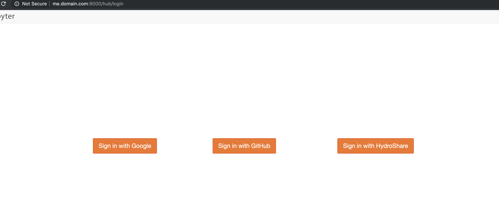

# Multi-oauthenticator demo

## Updates:

10/2019: Add support to CILogon - a "all-in-one authenticator" supports many academic institutes

9/2019: Initial version online

----------------
## What does this do?

This is a simple example of running jupyterhub with a multi-oauthenticator

See ticket: https://github.com/jupyterhub/oauthenticator/issues/136

Inspired by https://gist.github.com/danizen/78111676530738fcbca8d8ad87c56690

See example: examples/multi_oauth

## Tested OAuthenticators:
google
github
hydroshare (customized generic oauth authenticator)
CILogon

----------------

## Basic idea

This work was inspired by danizen's implementation (a hard-coded multi-authenticator for Google, GitHub and NIH login)

See: https://gist.github.com/danizen/78111676530738fcbca8d8ad87c56690

We extended it to work with any XXXXXOAuthenticator if it meets the following requirements, and made it configurable in jupyter_config.py

1)  XXXXXOAuthenticator is a subclass (or 'deeper' subclass) of OAuthenticator

2)  XXXXXOAuthenticator.login_handler is a subclass (or 'deeper' subclass) of OAuthLoginHandler

3)  XXXXXOAuthenticator.callback_handler is a subclass (or 'deeper' subclass) of OAuthCallbackHandler

4)  The above 3 classes should be unique for each OAuth provider (google, github, XXXXX .....)

For example, the official GoogleOAuthenticator meets all the 4 requirements:

GoogleOAuthenticator.login_handler is GoogleOAuthHandler

GoogleOAuthenticator.callback_handler is GoogleLoginHandler

However, the official GitHubOAuthenticator only meets (1) and (2), not (3) or (4), which can be fixed by subclassing the originals

class GitHubCallbackHandler(OAuthCallbackHandler):

    pass

class GitHubOAuthenticator_New(GitHubOAuthenticator):

    callback_handler = GitHubCallbackHandler

Now the we have a new GitHubOAuthenticator_New, whose .login_handler and .callback_handler are both unique

The reason is our code needs to use the instances of .login_handler and .callback_handler to find the associated XXXXXOAuthenticator class

## Configure multioauthenticator in  jupyter_config.py:

c.JupyterHub.authenticator_class = 'oauthenticator.multiauthenticator.MultiOAuthenticator'

c.GitHubOAuthenticator_New.oauth_callback_url = "http://me.domain.com:8000/hub/github/callback"

c.GitHubOAuthenticator_New.client_id = "xxx"

c.GitHubOAuthenticator_New.client_secret = "xxx"

c.GoogleOAuthenticator.oauth_callback_url = "http://me.domain.com:8000/hub/google/callback"

c.GoogleOAuthenticator.client_id = "xxxxx"

c.GoogleOAuthenticator.client_secret = "xxxx"

c.MultiOAuthenticator._auth_member_set = set([
    
    tuple([GitHubOAuthenticator_New, GitHubLoginHandler, GitHubCallbackHandler]),
    
    tuple([GoogleOAuthenticator, GoogleLoginHandler, GoogleOAuthHandler]),
    
    ##tuple([OtherOAuthenticator, OtherLoginHandler, OtherOAuthHandler]),
    
    ##tuple([AnotherOAuthenticator, AnotherLoginHandler, AnotherOAuthHandler]),
   
   ])

You may argue that just specifying the XXXXXXOAuthenticator class would be enough as it already references the other two classes in .login_handler and .callback_handler.

Yes that is right and our implementation could have been coded in that way. But we chose to let users explicitly list all the 3 classes in configurations to visually make sure they are all unique
   
Also, you need to use this modified login.html template:

c.JupyterHub.template_paths = ['/YOUR/FOLDER/HAS/LOGIN.HTML']

## Known issues and limitations:

1 The implementation from danizen seems to support any kind of Authenticator, not just OAuthenticator. But our work only focused on OAuthenticator.

As a result, they are some leftover codes in MultiLoginHandler.post are not being used in our case.

2 the login url and callback url are hard coded to follow:

/hub/xxxxx/login

/hub/xxxxx/callback

xxxxx is defined by XXXXXOAuthenticator.login_service (converted to lower case in url)

